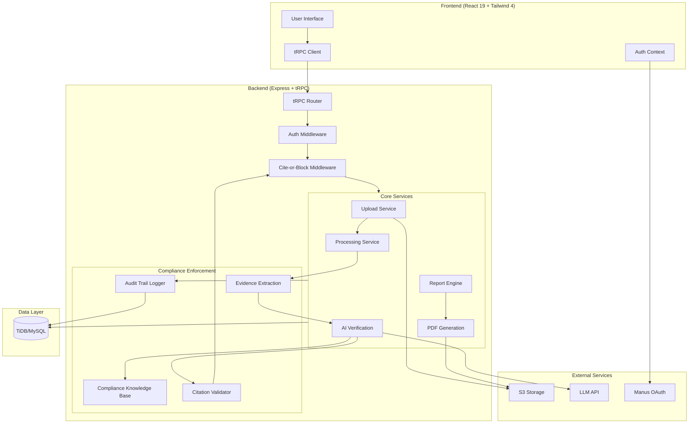
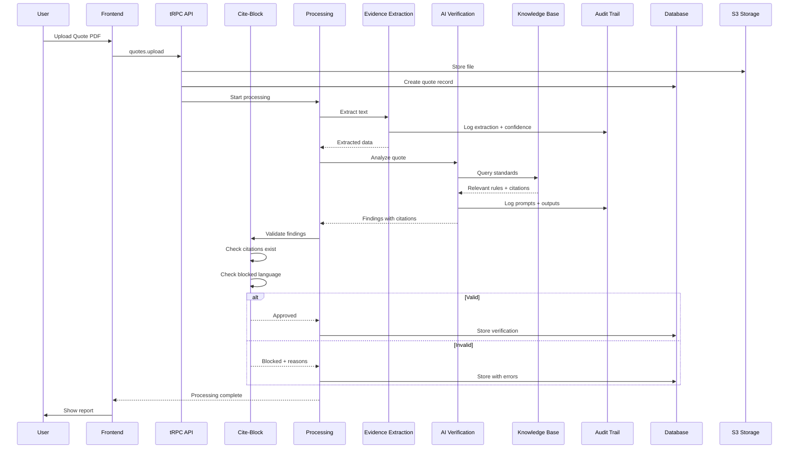
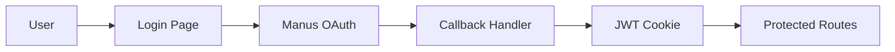
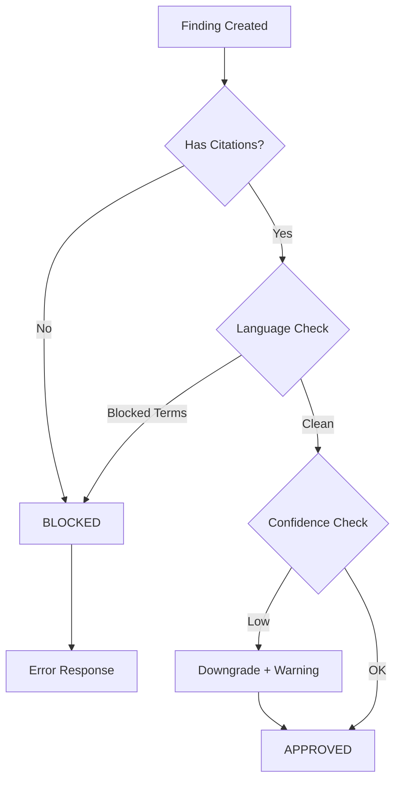
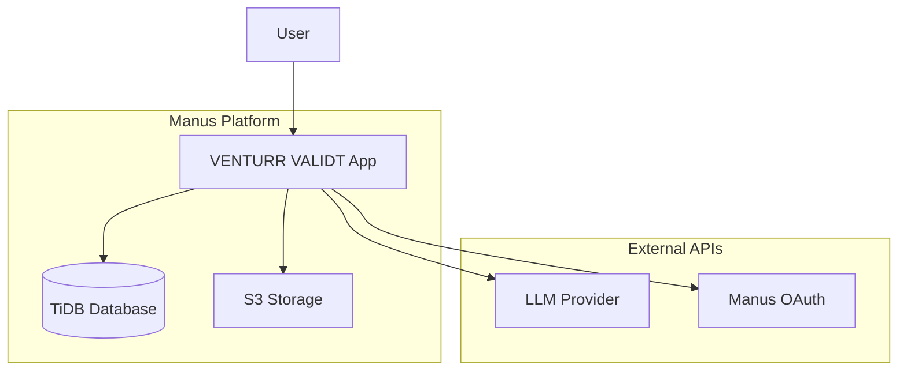

# VENTURR VALIDT - System Architecture

## Overview

VENTURR VALIDT is a compliance-locked quote verification platform that provides AI-powered analysis of construction quotes against Australian building standards. The system enforces cite-or-block rules ensuring every claim is backed by verifiable citations.

## Architecture Diagram

## Component Details

### Frontend Layer

| Component | Technology | Purpose |
|-----------|------------|---------|
| UI Framework | React 19 | Component-based user interface |
| Styling | Tailwind CSS 4 | Utility-first CSS framework |
| State Management | React Query (via tRPC) | Server state synchronization |
| Routing | Wouter | Lightweight client-side routing |
| Components | shadcn/ui | Accessible UI component library |

### Backend Layer

| Component | Technology | Purpose |
|-----------|------------|---------|
| Server | Express 4 | HTTP server and middleware |
| API | tRPC 11 | Type-safe API layer |
| Authentication | JWT + Manus OAuth | User authentication and sessions |
| Validation | Zod | Runtime type validation |

### Core Services

| Service | File | Responsibility |
|---------|------|----------------|
| Upload Service | `server/routers.ts` | Handle file uploads to S3 |
| Processing Service | `server/processingService.ts` | Orchestrate verification pipeline |
| AI Verification | `server/aiVerification.ts` | LLM-powered quote analysis |
| Report Engine | `server/reportEngine.ts` | Generate structured reports |
| PDF Generation | `server/pdfGeneration.ts` | Convert reports to PDF |

### Compliance Enforcement

| Component | File | Responsibility |
|-----------|------|----------------|
| Audit Trail | `server/auditTrail.ts` | Log all inputs, prompts, outputs |
| Evidence Extraction | `server/evidenceExtraction.ts` | PDF/OCR text extraction with confidence |
| Knowledge Base | `server/complianceKnowledgeBase.ts` | Versioned standards library |
| Citation Validator | `server/citeOrBlockMiddleware.ts` | Block uncited findings |

## Data Flow

### Quote Verification Flow

## Database Schema

### Core Tables

| Table | Purpose | Key Fields |
|-------|---------|------------|
| `users` | User accounts | id, openId, name, email, role |
| `quotes` | Uploaded quotes | id, userId, fileName, fileUrl, status, extractedData |
| `verifications` | Analysis results | id, quoteId, scores, findings, citations |
| `audit_logs` | Compliance trail | id, quoteId, action, data, timestamp |

### Supporting Tables

| Table | Purpose |
|-------|---------|
| `contractors` | Contractor directory |
| `contractor_portfolios` | Work samples |
| `contractor_certifications` | License/cert records |
| `quote_comparisons` | Multi-quote comparisons |
| `shared_reports` | Report sharing links |
| `notifications` | User notifications |
| `notification_preferences` | Notification settings |

## Security Architecture

### Authentication Flow

### Access Control

| Level | Implementation |
|-------|----------------|
| Route Protection | `protectedProcedure` wrapper |
| Role-Based Access | `ctx.user.role` checks |
| Resource Ownership | `userId` foreign key validation |
| API Security | Rate limiting, input validation |

## Compliance Architecture

### Cite-or-Block Enforcement Points

### Audit Trail Structure

Every verification run logs:

1. **Inputs**: File metadata, user context, timestamp
2. **Extraction**: Text content, confidence score, method (PDF/OCR)
3. **Sources**: Standards retrieved, editions, clauses
4. **Prompts**: Versioned prompt templates used
5. **Outputs**: Scores, findings, citations, warnings

## Deployment Architecture

## Performance Considerations

| Metric | Target | Implementation |
|--------|--------|----------------|
| Report Generation | < 60s P95 | Async processing, progress tracking |
| File Upload | < 10s | Direct S3 upload, chunking |
| API Response | < 200ms P95 | tRPC batching, query optimization |
| Concurrent Users | 100+ | Stateless design, connection pooling |

## Error Handling Strategy

| Error Type | Handling |
|------------|----------|
| Extraction Failure | Return "Insufficient evidence" finding |
| LLM Timeout | Retry with backoff, then explicit error |
| Citation Missing | Block persistence, return validation error |
| Invalid Input | Zod validation with detailed messages |
| System Error | Log to audit trail, user-friendly message |

---

*Last Updated: December 2024*
*Version: 1.0.0*
