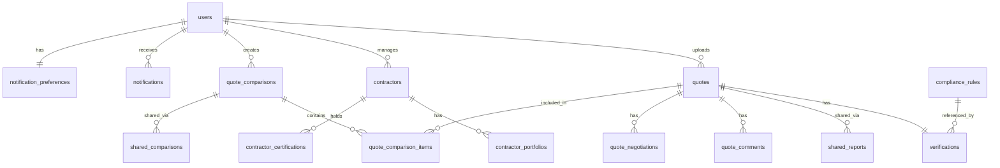

# VENTURR VALIDT - Database Schema Documentation

## Overview

VENTURR VALIDT uses TiDB (MySQL-compatible) as its primary database. The schema is managed through Drizzle ORM with type-safe queries and migrations.

## Entity Relationship Diagram



## Core Tables

### users

Stores user account information from Manus OAuth.

| Column | Type | Constraints | Description |
|--------|------|-------------|-------------|
| id | INT | PK, AUTO_INCREMENT | Internal user ID |
| open_id | VARCHAR(255) | UNIQUE, NOT NULL | Manus OAuth identifier |
| name | VARCHAR(255) | NOT NULL | Display name |
| email | VARCHAR(255) | | Email address |
| avatar_url | VARCHAR(512) | | Profile picture URL |
| role | ENUM('admin', 'user') | DEFAULT 'user' | Access level |
| created_at | TIMESTAMP | DEFAULT NOW() | Account creation |
| updated_at | TIMESTAMP | ON UPDATE NOW() | Last modification |

### quotes

Stores uploaded quote documents and extracted data.

| Column | Type | Constraints | Description |
|--------|------|-------------|-------------|
| id | INT | PK, AUTO_INCREMENT | Quote ID |
| user_id | INT | FK → users.id | Owner |
| file_name | VARCHAR(255) | NOT NULL | Original filename |
| file_key | VARCHAR(512) | NOT NULL | S3 object key |
| file_url | VARCHAR(1024) | NOT NULL | S3 public URL |
| file_size | INT | NOT NULL | File size in bytes |
| mime_type | VARCHAR(100) | NOT NULL | Content type |
| status | ENUM | NOT NULL | Processing status |
| extracted_data | JSON | | Parsed quote content |
| created_at | TIMESTAMP | DEFAULT NOW() | Upload time |
| updated_at | TIMESTAMP | ON UPDATE NOW() | Last update |
| processed_at | TIMESTAMP | | Verification completion |

**Status Values:**
- `uploaded` - File received, awaiting processing
- `processing` - Verification in progress
- `completed` - Analysis complete
- `failed` - Processing error

### verifications

Stores AI verification results with scores and findings.

| Column | Type | Constraints | Description |
|--------|------|-------------|-------------|
| id | INT | PK, AUTO_INCREMENT | Verification ID |
| quote_id | INT | FK → quotes.id, UNIQUE | Associated quote |
| overall_score | INT | NOT NULL | Aggregate score (0-100) |
| pricing_score | INT | NOT NULL | Pricing analysis score |
| materials_score | INT | NOT NULL | Materials verification score |
| compliance_score | INT | NOT NULL | Compliance check score |
| warranty_score | INT | NOT NULL | Warranty analysis score |
| potential_savings | DECIMAL(10,2) | | Estimated savings |
| status_badge | ENUM | NOT NULL | Visual indicator |
| flags | JSON | | Warning flags array |
| recommendations | JSON | | Improvement suggestions |
| pricing_analysis | JSON | | Detailed pricing data |
| materials_analysis | JSON | | Detailed materials data |
| compliance_analysis | JSON | | Detailed compliance data |
| warranty_analysis | JSON | | Detailed warranty data |
| created_at | TIMESTAMP | DEFAULT NOW() | Analysis time |
| updated_at | TIMESTAMP | ON UPDATE NOW() | Last update |

**Status Badge Values:**
- `green` - Score ≥ 85, no critical issues
- `amber` - Score 70-84, some concerns
- `red` - Score < 70, significant issues

## Contractor Tables

### contractors

Stores contractor directory information.

| Column | Type | Constraints | Description |
|--------|------|-------------|-------------|
| id | INT | PK, AUTO_INCREMENT | Contractor ID |
| user_id | INT | FK → users.id | Owner (for private contractors) |
| business_name | VARCHAR(255) | NOT NULL | Company name |
| contact_name | VARCHAR(255) | | Primary contact |
| email | VARCHAR(255) | | Contact email |
| phone | VARCHAR(50) | | Contact phone |
| address | TEXT | | Business address |
| license_number | VARCHAR(100) | | Trade license |
| abn | VARCHAR(20) | | Australian Business Number |
| specializations | JSON | | Service categories |
| service_areas | JSON | | Geographic coverage |
| rating | DECIMAL(2,1) | | Average rating (0-5) |
| review_count | INT | DEFAULT 0 | Number of reviews |
| verified | BOOLEAN | DEFAULT FALSE | Identity verified |
| created_at | TIMESTAMP | DEFAULT NOW() | Record creation |
| updated_at | TIMESTAMP | ON UPDATE NOW() | Last update |

### contractor_portfolios

Stores contractor work samples.

| Column | Type | Constraints | Description |
|--------|------|-------------|-------------|
| id | INT | PK, AUTO_INCREMENT | Portfolio item ID |
| contractor_id | INT | FK → contractors.id | Owner contractor |
| title | VARCHAR(255) | NOT NULL | Project title |
| description | TEXT | | Project description |
| image_url | VARCHAR(1024) | | Photo URL |
| project_type | VARCHAR(100) | | Category |
| completion_date | DATE | | When completed |
| created_at | TIMESTAMP | DEFAULT NOW() | Record creation |

### contractor_certifications

Stores contractor licenses and certifications.

| Column | Type | Constraints | Description |
|--------|------|-------------|-------------|
| id | INT | PK, AUTO_INCREMENT | Certification ID |
| contractor_id | INT | FK → contractors.id | Owner contractor |
| name | VARCHAR(255) | NOT NULL | Certification name |
| issuer | VARCHAR(255) | | Issuing authority |
| number | VARCHAR(100) | | Certificate number |
| issue_date | DATE | | When issued |
| expiry_date | DATE | | Expiration date |
| document_url | VARCHAR(1024) | | Certificate file URL |
| verified | BOOLEAN | DEFAULT FALSE | Verified by system |
| created_at | TIMESTAMP | DEFAULT NOW() | Record creation |

## Comparison Tables

### quote_comparisons

Stores multi-quote comparison sessions.

| Column | Type | Constraints | Description |
|--------|------|-------------|-------------|
| id | INT | PK, AUTO_INCREMENT | Comparison ID |
| user_id | INT | FK → users.id | Owner |
| name | VARCHAR(255) | | Comparison name |
| status | ENUM | DEFAULT 'pending' | Analysis status |
| recommendation | JSON | | AI recommendation |
| created_at | TIMESTAMP | DEFAULT NOW() | Creation time |
| updated_at | TIMESTAMP | ON UPDATE NOW() | Last update |

### quote_comparison_items

Links quotes to comparisons.

| Column | Type | Constraints | Description |
|--------|------|-------------|-------------|
| id | INT | PK, AUTO_INCREMENT | Item ID |
| comparison_id | INT | FK → quote_comparisons.id | Parent comparison |
| quote_id | INT | FK → quotes.id | Included quote |
| created_at | TIMESTAMP | DEFAULT NOW() | When added |

## Sharing Tables

### shared_reports

Stores report sharing links.

| Column | Type | Constraints | Description |
|--------|------|-------------|-------------|
| id | INT | PK, AUTO_INCREMENT | Share ID |
| quote_id | INT | FK → quotes.id | Shared quote |
| user_id | INT | FK → users.id | Sharer |
| token | VARCHAR(64) | UNIQUE, NOT NULL | Access token |
| expires_at | TIMESTAMP | NOT NULL | Link expiration |
| view_count | INT | DEFAULT 0 | Access count |
| created_at | TIMESTAMP | DEFAULT NOW() | Creation time |

### shared_comparisons

Stores comparison sharing links.

| Column | Type | Constraints | Description |
|--------|------|-------------|-------------|
| id | INT | PK, AUTO_INCREMENT | Share ID |
| comparison_id | INT | FK → quote_comparisons.id | Shared comparison |
| user_id | INT | FK → users.id | Sharer |
| token | VARCHAR(64) | UNIQUE, NOT NULL | Access token |
| expires_at | TIMESTAMP | NOT NULL | Link expiration |
| view_count | INT | DEFAULT 0 | Access count |
| created_at | TIMESTAMP | DEFAULT NOW() | Creation time |

## Collaboration Tables

### quote_comments

Stores comments on quotes.

| Column | Type | Constraints | Description |
|--------|------|-------------|-------------|
| id | INT | PK, AUTO_INCREMENT | Comment ID |
| quote_id | INT | FK → quotes.id | Target quote |
| user_id | INT | FK → users.id | Author |
| content | TEXT | NOT NULL | Comment text |
| created_at | TIMESTAMP | DEFAULT NOW() | Post time |
| updated_at | TIMESTAMP | ON UPDATE NOW() | Edit time |

### quote_negotiations

Stores negotiation tracking.

| Column | Type | Constraints | Description |
|--------|------|-------------|-------------|
| id | INT | PK, AUTO_INCREMENT | Negotiation ID |
| quote_id | INT | FK → quotes.id | Target quote |
| user_id | INT | FK → users.id | Owner |
| original_amount | DECIMAL(12,2) | | Starting price |
| negotiated_amount | DECIMAL(12,2) | | Current offer |
| status | ENUM | DEFAULT 'pending' | Negotiation status |
| notes | TEXT | | Discussion notes |
| created_at | TIMESTAMP | DEFAULT NOW() | Start time |
| updated_at | TIMESTAMP | ON UPDATE NOW() | Last update |

## Notification Tables

### notifications

Stores user notifications.

| Column | Type | Constraints | Description |
|--------|------|-------------|-------------|
| id | INT | PK, AUTO_INCREMENT | Notification ID |
| user_id | INT | FK → users.id | Recipient |
| type | VARCHAR(50) | NOT NULL | Notification category |
| title | VARCHAR(255) | NOT NULL | Notification title |
| message | TEXT | NOT NULL | Notification body |
| data | JSON | | Additional metadata |
| read | BOOLEAN | DEFAULT FALSE | Read status |
| created_at | TIMESTAMP | DEFAULT NOW() | Send time |

### notification_preferences

Stores user notification settings.

| Column | Type | Constraints | Description |
|--------|------|-------------|-------------|
| id | INT | PK, AUTO_INCREMENT | Preference ID |
| user_id | INT | FK → users.id, UNIQUE | Owner |
| email_enabled | BOOLEAN | DEFAULT TRUE | Email notifications |
| push_enabled | BOOLEAN | DEFAULT TRUE | Push notifications |
| quote_updates | BOOLEAN | DEFAULT TRUE | Quote status changes |
| system_alerts | BOOLEAN | DEFAULT TRUE | System notifications |
| marketing | BOOLEAN | DEFAULT FALSE | Marketing emails |
| created_at | TIMESTAMP | DEFAULT NOW() | Creation time |
| updated_at | TIMESTAMP | ON UPDATE NOW() | Last update |

## Compliance Tables

### compliance_rules

Stores versioned compliance standards.

| Column | Type | Constraints | Description |
|--------|------|-------------|-------------|
| id | INT | PK, AUTO_INCREMENT | Rule ID |
| standard | VARCHAR(100) | NOT NULL | Standard name |
| edition | VARCHAR(50) | NOT NULL | Edition/version |
| clause | VARCHAR(100) | NOT NULL | Clause reference |
| title | VARCHAR(255) | NOT NULL | Rule title |
| content | TEXT | NOT NULL | Rule text |
| interpretation | TEXT | | Application guidance |
| category | VARCHAR(100) | | Rule category |
| url | VARCHAR(1024) | | Source URL |
| effective_date | DATE | | When effective |
| superseded_date | DATE | | When replaced |
| created_at | TIMESTAMP | DEFAULT NOW() | Record creation |
| updated_at | TIMESTAMP | ON UPDATE NOW() | Last update |

**Index:** UNIQUE(standard, edition, clause)

## Indexes

### Performance Indexes

```sql
-- User lookups
CREATE INDEX idx_users_open_id ON users(open_id);

-- Quote queries
CREATE INDEX idx_quotes_user_id ON quotes(user_id);
CREATE INDEX idx_quotes_status ON quotes(status);
CREATE INDEX idx_quotes_created_at ON quotes(created_at);

-- Verification lookups
CREATE INDEX idx_verifications_quote_id ON verifications(quote_id);

-- Contractor searches
CREATE INDEX idx_contractors_user_id ON contractors(user_id);
CREATE INDEX idx_contractors_verified ON contractors(verified);

-- Share token lookups
CREATE INDEX idx_shared_reports_token ON shared_reports(token);
CREATE INDEX idx_shared_comparisons_token ON shared_comparisons(token);

-- Notification queries
CREATE INDEX idx_notifications_user_id ON notifications(user_id);
CREATE INDEX idx_notifications_read ON notifications(read);

-- Compliance rule searches
CREATE INDEX idx_compliance_rules_standard ON compliance_rules(standard);
CREATE INDEX idx_compliance_rules_category ON compliance_rules(category);
```

## Migration History

| Version | Date | Description |
|---------|------|-------------|
| 001 | 2024-12 | Initial schema with users, quotes, verifications |
| 002 | 2024-12 | Add contractors and portfolios |
| 003 | 2024-12 | Add sharing and collaboration |
| 004 | 2024-12 | Add comparisons |
| 005 | 2024-12 | Add compliance rules |
| 006 | 2024-12 | Add notifications |

---

*Last Updated: December 2024*
*Version: 1.0.0*
