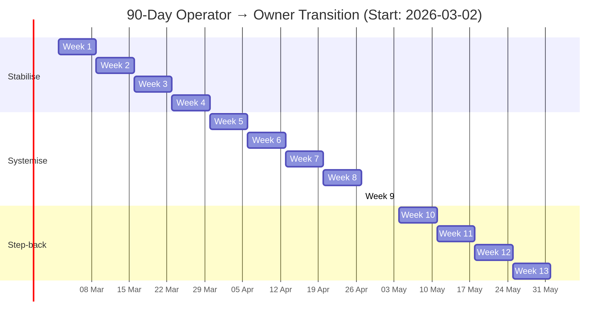

# Jaye OS — One-Thing-Aligned Notion Operating System

A personalised operating system for the Operator → Owner transition, built around *The ONE Thing* ideology: one priority that makes the rest easier or unnecessary.

## System Architecture

This operating system consists of six Notion components (one dashboard, five databases) plus a Google Calendar integration. It is intentionally minimal — you can extend it later, but it works as-is.

```
Jaye OS — Master Dashboard
├── Nightly Reset (daily energy + ONE Thing tracking)
├── Weekly Calibration (weekly lead domino + alignment scoring)
├── Monthly Measurement (monthly kill/systemise decisions)
├── Quarterly Reset (quarterly strategy + role transition)
└── Yearly Reinvention (annual identity + direction alignment)
```

## Directory Structure

```
jaye-os/
├── README.md                          ← You are here
├── csv/
│   ├── nightly-reset.csv              ← Notion import: Nightly Reset database
│   ├── weekly-calibration.csv         ← Notion import: Weekly Calibration database
│   ├── monthly-measurement.csv        ← Notion import: Monthly Measurement database
│   ├── quarterly-reset.csv            ← Notion import: Quarterly Reset database
│   └── yearly-reinvention.csv         ← Notion import: Yearly Reinvention database
├── calendar/
│   └── jaye-os-schedule.ics           ← Google Calendar import: all recurring blocks
├── docs/
│   ├── NOTION_SETUP_CHECKLIST.md      ← Step-by-step Notion setup guide
│   ├── 90_DAY_TRANSITION_PLAN.md      ← 13-week Operator → Owner milestones
│   └── STRATEGY_GUARDRAILS.md         ← Good vs bad strategy + 10 effort cuts
└── diagrams/
    ├── 90-day-timeline.mmd            ← Mermaid source for the Gantt chart
    └── 90-day-timeline.png            ← Rendered timeline image
```

## Quick Start

1. **Set up Notion** — Follow `docs/NOTION_SETUP_CHECKLIST.md` (approximately 90 minutes)
2. **Import calendar** — Import `calendar/jaye-os-schedule.ics` into Google Calendar
3. **Import data** — Import the CSV files into their corresponding Notion databases
4. **Start the 90-day plan** — Follow `docs/90_DAY_TRANSITION_PLAN.md` starting Monday 2 March 2026
5. **Apply the guardrails** — Reference `docs/STRATEGY_GUARDRAILS.md` for effort cuts and strategy checks

## Calendar Events Imported

| Event | Schedule | Duration |
|---|---|---|
| ONE Thing Block (Protected) | Mon–Fri 6:00 AM | 60 min |
| Operator Window (ThomCo) | Mon–Fri 7:30 AM | 5 hours |
| Close Loops | Mon–Fri 4:30 PM | 30 min |
| Architect Build Block #1 (Venturr) | Tuesday 1:30 PM | 2 hours |
| Midweek Calibration | Wednesday 12:15 PM | 30 min |
| Architect Build Block #2 (Venturr) | Thursday 1:30 PM | 2 hours |
| Weekly Calibration | Friday 2:30 PM | 60 min |
| Friday Admin Batch | Friday 3:30 PM | 60 min |
| Weekly ONE Thing Selection | Sunday 7:00 PM | 15 min |
| Nightly Reset | Daily 9:30 PM | 10 min |
| Monthly Measurement | 1st of each month 2:00 PM | 60 min |
| Quarterly Reset | 1st of Jan/Apr/Jul/Oct 9:00 AM | 2 hours |

## Founder Alignment Score

A weekly 0–100 score computed from:
- **Energy** (40 points): Average nightly energy rating / 10 × 40
- **Focus Integrity** (40 points): % of ONE Thing blocks completed × 40
- **Completion** (20 points): Weekly status (Done = 20, In Progress = 10, Planned = 0)

| Score | Meaning |
|---|---|
| 80–100 | System working — rhythm holding |
| 60–79 | Functional but slipping — one area needs attention |
| 40–59 | Under stress — operator overload likely |
| Below 40 | System broken — reset required |

## 90-Day Timeline



## Core Operating Rules

1. **One protected block per day (minimum viable).** Protect a single block; keep the rest flexible.
2. **One task per block.** Do not schedule two tasks in the same block.
3. **Batch the reactive.** Email, admin, and return calls get a dedicated window.
4. **Weekly ONE Thing governs daily ONE Thing.** Your daily ONE Thing must serve the weekly lead domino.
5. **Review weekly, adjust monthly, decide quarterly.** This is the rhythm.

## Timezone

All times are in **Australia/Sydney (AEDT/AEST)**. The ICS file includes proper timezone definitions with daylight saving transitions.
