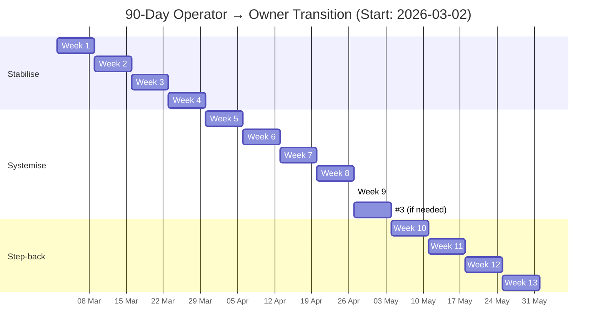

# 90-Day Operator → Owner Transition Plan

## Overview

This plan starts on **Monday 2 March 2026** (aligned to week boundaries in Australia/Sydney). It is structured as three phases over 13 weeks: **Stabilise → Systemise → Step-back**. Each phase builds on the previous one. The goal is to transition from operator (doing the work, making every decision) to owner (designing the system, setting direction, building leverage).

The plan is designed to be **realistic under volatility**. If a week slips, the structure holds — you pick up the next milestone and keep moving. The system is rhythmic, not rigid.

---

## Phase 1: Stabilise (Weeks 1–4)

**Phase objective:** Install the operating rhythm and identify the sources of operator chaos. No structural changes yet — this phase is about observation, measurement, and establishing the non-negotiable blocks.

**Success criteria:** Calendar blocks running for 4 consecutive weeks. Nightly Reset completed 5+ times per week. Top 3 operator bottlenecks identified and ranked.

---

### Week 1 (2 Mar – 8 Mar): Establish the Rhythm

**ONE Thing:** Define your weekly ONE Thing theme for the entire quarter and establish calendar blocks plus nightly resets.

**Milestones:**
- [ ] Import the ICS calendar file into Google Calendar
- [ ] Set up the Notion OS (Master Dashboard + 5 databases) using the setup checklist
- [ ] Define the quarterly ONE Thing theme (recommended: "Replace my time with systems")
- [ ] Complete the first 5 Nightly Resets
- [ ] Complete the first Weekly Calibration on Friday
- [ ] Select Week 2's ONE Thing on Sunday evening

**Key metric:** 5/5 Nightly Resets completed. ONE Thing block protected on at least 3/5 days.

**Risk:** System feels like overhead. **Mitigation:** Keep it under 10 minutes per night. If it feels heavy, strip it back — the minimum viable version is: energy score + ONE Thing completed checkbox.

---

### Week 2 (9 Mar – 15 Mar): Identify Bottlenecks

**ONE Thing:** Identify the top 3 operator bottlenecks causing repeat interruption and choose one to fix first.

**Milestones:**
- [ ] Review Week 1's Nightly Reset data — what patterns emerge?
- [ ] List every interruption that broke a protected block this week
- [ ] Identify the top 3 operator bottlenecks (e.g., quoting churn, staff calling for decisions, supplier delays)
- [ ] Rank them by frequency × impact
- [ ] Choose the #1 bottleneck to address in Week 3
- [ ] Complete Weekly Calibration — record bottleneck ranking

**Key metric:** 3 bottlenecks identified and ranked. ONE Thing block protected on at least 4/5 days.

**Risk:** Bottlenecks feel overwhelming. **Mitigation:** You are only choosing one. The others wait. This is the ONE Thing logic in action.

---

### Week 3 (16 Mar – 22 Mar): Build the First Checklist

**ONE Thing:** Build and implement one standard "Definition of Done" checklist for a repeat job type so decisions stop living in your head.

**Milestones:**
- [ ] Choose the most common repeat job type in ThomCo
- [ ] Write a "Definition of Done" checklist: what does complete look like for this job type?
- [ ] Include: materials needed, quality standards, sign-off criteria, handover steps
- [ ] Test the checklist on at least one live job this week
- [ ] Capture feedback — what's missing, what's unnecessary?
- [ ] Refine and store the checklist where the crew can access it

**Key metric:** Checklist created, tested on one job, and refined. Crew can execute the job type without calling you for every decision.

**Risk:** Checklist is too detailed or too vague. **Mitigation:** Start with 10 items maximum. If it's longer than one page, it's too complex. Iterate next week.

---

### Week 4 (23 Mar – 29 Mar): Install Comms Batching

**ONE Thing:** Install a batching rule — all non-emergency calls and messages handled in two windows daily.

**Milestones:**
- [ ] Define the two daily communication windows (recommended: 12:30 PM and 4:30 PM)
- [ ] Communicate the new protocol to the team and key clients
- [ ] Set phone to silent/DND outside communication windows (except for safety emergencies)
- [ ] Track compliance — how many times did you break the rule this week?
- [ ] Implement staff escalation office hours (recommended: 7:15–7:30 AM and 3:30–3:45 PM)
- [ ] Complete Monthly Measurement for March

**Key metric:** Communication windows operational for 5/5 days. Fewer than 3 rule breaks per day by end of week.

**Risk:** Team or clients resist. **Mitigation:** Frame it as "I'm more responsive during these windows because I'm not distracted." Most resistance dissolves within 2 weeks.

---

## Phase 2: Systemise (Weeks 5–9)

**Phase objective:** Convert the bottlenecks identified in Phase 1 into systems, playbooks, and delegated functions. This is where the operator load starts to structurally decrease.

**Success criteria:** Decision playbook v1 live. One function delegated with written SOP. Job tracker operational. Weekly bottleneck-kill rhythm established.

---

### Week 5 (30 Mar – 5 Apr): Decision Playbook v1

**ONE Thing:** Convert your most common operator decisions into a one-page "If X then Y" playbook.

**Milestones:**
- [ ] List the top 5 decisions you make repeatedly (e.g., "Client asks for change order" → "Quote within 24 hours using template, minimum margin applies")
- [ ] Write each as an If/Then rule on a single page
- [ ] Share the playbook with the team
- [ ] Test it: when a decision comes up this week, point to the playbook instead of answering directly
- [ ] Capture any gaps — decisions that aren't covered

**Key metric:** Playbook created with 5+ decision rules. At least 2 decisions handled by the team using the playbook without your involvement.

---

### Week 6 (6 Apr – 12 Apr): Single Source of Truth for Jobs

**ONE Thing:** Create a single source of truth for jobs — status, next action, blocker, owner.

**Milestones:**
- [ ] Choose the tool (Notion database, spreadsheet, or existing system)
- [ ] Create the job tracker with columns: Job Name, Status (Not Started / In Progress / Blocked / Done), Next Action, Blocker, Owner, Due Date
- [ ] Populate with all current active jobs
- [ ] Set a rule: every job must be in the tracker. If it's not in the tracker, it doesn't exist.
- [ ] Review the tracker during Midweek Calibration

**Key metric:** All active jobs tracked in one place. Team updates status without being asked.

---

### Week 7 (13 Apr – 19 Apr): Delegate One Function

**ONE Thing:** Delegate one recurring function (admin, ordering, scheduling, or client comms) with a written SOP.

**Milestones:**
- [ ] Choose the function to delegate (pick the one that consumes the most of your time and is most repeatable)
- [ ] Write the SOP: step-by-step instructions that someone else can follow without asking you questions
- [ ] Identify the delegate (existing team member or contractor)
- [ ] Hand off the function with the SOP
- [ ] Monitor the first execution — provide feedback, not takeover
- [ ] Refine the SOP based on the delegate's experience

**Key metric:** Function delegated. Delegate completes one full cycle without founder intervention.

---

### Week 8 (20 Apr – 26 Apr): Weekly Bottleneck-Kill Rhythm

**ONE Thing:** Implement the weekly "bottleneck kill" meeting (even if solo) and track it in Weekly Calibration.

**Milestones:**
- [ ] Add "Bottleneck Kill" as a standing item in your Weekly Calibration
- [ ] Each week, identify the single biggest bottleneck from the past 7 days
- [ ] Define the fix: what would eliminate this bottleneck permanently?
- [ ] Execute the fix this week
- [ ] Track cumulative bottlenecks killed (target: 13 by end of 90 days)

**Key metric:** First bottleneck-kill completed and tracked. Process feels sustainable.

---

### Week 9 (27 Apr – 3 May): Add Third Architect Block (If Needed)

**ONE Thing:** Protect a third Architect block per week if Venturr traction is the quarter's lead domino.

**Milestones:**
- [ ] Review Venturr progress: are 2 blocks per week producing sufficient output?
- [ ] If yes: maintain 2 blocks and use the freed time for operator system-building
- [ ] If no: add a third block (recommended: Saturday morning or Monday afternoon)
- [ ] Ensure the third block has the same protection rules as blocks 1 and 2
- [ ] Complete Monthly Measurement for April — assess operator load vs architect load

**Key metric:** Decision made (add or maintain). If added, third block protected for the week.

---

## Phase 3: Step-back (Weeks 10–13)

**Phase objective:** Test whether the machine runs without you. Progressively reduce your operator involvement and capture the gaps that emerge. Make one structural decision that permanently reduces operator load.

**Success criteria:** One full no-touch day completed. One structural decision made and implemented. Next quarter's ONE Thing locked.

---

### Week 10 (4 May – 10 May): Reduce Operator Availability

**ONE Thing:** Reduce operator availability by one half-day per week — you become unavailable except for emergencies.

**Milestones:**
- [ ] Choose the half-day (recommended: Thursday afternoon, since you already have Architect Block #2)
- [ ] Communicate to the team: "Thursday afternoon I am unavailable unless it is a safety or cash emergency"
- [ ] During the half-day: work on Venturr or strategic thinking only
- [ ] Track what happens: did the team handle issues? What escalated unnecessarily?
- [ ] Debrief in Weekly Calibration

**Key metric:** Half-day completed without founder intervention. Team handled at least 80% of issues independently.

---

### Week 11 (11 May – 17 May): No-Touch Day Test

**ONE Thing:** Run a "no-touch day" test — one full day where others operate the machine without you. Capture failures as system gaps.

**Milestones:**
- [ ] Choose the day (recommended: Wednesday — midweek stress-test)
- [ ] Brief the team: "I am completely unavailable tomorrow. Handle everything. Document anything you can't resolve."
- [ ] Do not check messages, email, or calls for the entire day
- [ ] At end of day: collect the team's list of unresolved issues
- [ ] Categorise each issue: system gap (needs a new SOP/playbook entry) vs one-off (acceptable)
- [ ] Add system gaps to the bottleneck-kill queue

**Key metric:** No-touch day completed. Fewer than 3 genuine system gaps identified. Revenue and operations unaffected.

---

### Week 12 (18 May – 24 May): Quarterly Reset Decision

**ONE Thing:** Choose one structural decision that permanently reduces operator load (pricing, client type, job mix, or hiring).

**Milestones:**
- [ ] Review the full 90-day data: energy trends, alignment scores, bottlenecks killed, operator vs architect time
- [ ] Identify the single structural change that would have the biggest permanent impact
- [ ] Options to consider:
  - Raise prices to eliminate low-margin work
  - Exit a client segment that creates disproportionate friction
  - Hire or contract an operator lead who handles day-to-day decisions
  - Simplify the job mix to reduce scheduling complexity
- [ ] Make the decision and commit to implementation
- [ ] Write the implementation plan (who, what, when, how)
- [ ] Complete Monthly Measurement for May

**Key metric:** One structural decision made with a written implementation plan.

---

### Week 13 (25 May – 31 May): Lock the Next Quarter

**ONE Thing:** Lock the next quarter's ONE Thing and update the Yearly Reinvention page with "what changed".

**Milestones:**
- [ ] Complete the Quarterly Reset in Notion:
  - Diagnosis: What is the binding constraint entering Q3?
  - Guiding Policy: What is the one policy that addresses it?
  - Coherent Actions: What are the 3 (max) actions?
  - Operator Load Target vs Architect Load Target
- [ ] Update the Yearly Reinvention page: what has changed since the start of the year?
- [ ] Set Q3's ONE Thing using the Focusing Question
- [ ] Review the transition scorecard:
  - Operator hours per week: target reduction of 30%+
  - Architect outputs shipped: target 2+ per week consistently
  - Alignment Score trend: target 70+ average
  - Bottlenecks killed: target 10+ cumulative
- [ ] Celebrate the progress. Then get back to work.

**Key metric:** Q3 ONE Thing locked. Yearly Reinvention updated. Transition scorecard completed.

---

## Transition Scorecard

Use this scorecard at the end of Week 13 to measure the transition:

| Metric | Baseline (Week 1) | Target (Week 13) | Actual (Week 13) |
|---|---|---|---|
| Operator hours per week | _____ | Reduced by 30%+ | _____ |
| Architect outputs shipped per week | _____ | 2+ consistently | _____ |
| Average weekly Alignment Score | _____ | 70+ | _____ |
| Bottlenecks killed (cumulative) | 0 | 10+ | _____ |
| Functions delegated | 0 | 1+ | _____ |
| SOPs/playbooks created | 0 | 3+ | _____ |
| No-touch days completed | 0 | 1+ | _____ |
| Structural decisions made | 0 | 1 | _____ |

---

## Mermaid Timeline

---

## Operating Rules for the 90 Days

1. **One milestone per week.** Do not try to do two weeks in one. The compounding effect requires consistency, not speed.
2. **If a week slips, skip it and move to the next.** The structure holds even if individual weeks are imperfect.
3. **Track in the system, not in your head.** Every milestone, bottleneck, and decision goes into the Notion OS.
4. **The ONE Thing block is sacred.** If you protect nothing else, protect this.
5. **Review weekly, adjust monthly, decide quarterly.** This is the rhythm. Do not change the system more frequently than monthly.
